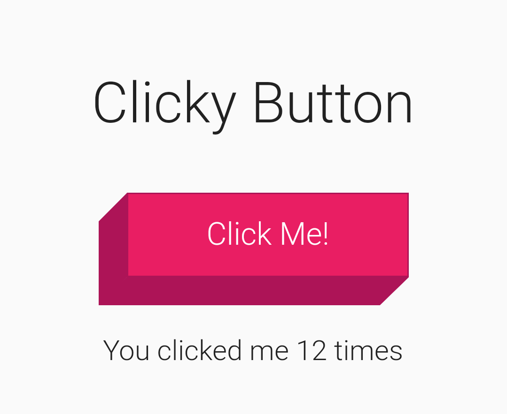
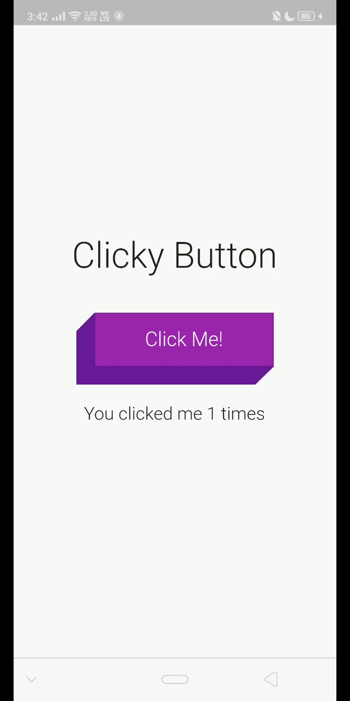

# Clicky Button for flutter



A Custom 3D Button in Flutter

## Demo



## How To Use it

```
import 'clicky_button/clicky_button.dart'

...
ClickyButton(
    child: Text(
    'Click Me!',
    style: TextStyle(
        color: Colors.white,
        fontSize: 22),
    ),
    color: Colors.green,
    onPressed: () {},
)
...
```

#### To change size of button just wrap button in Transform.scale()

```
import 'clicky_button/clicky_button.dart'

...
Transform.scale(
    scale: 0.6,
    child: ClickyButton(
            child: Text(
            'Click Me!',
            style: TextStyle(
                color: Colors.white,
                fontSize: 22),
            ),
            color: Colors.green,
            onPressed: () {},
        ),
)
...
```

### Thank you
